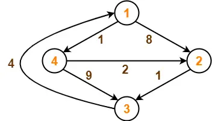
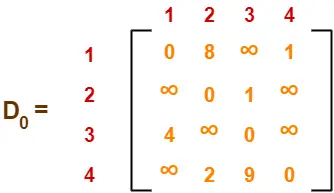
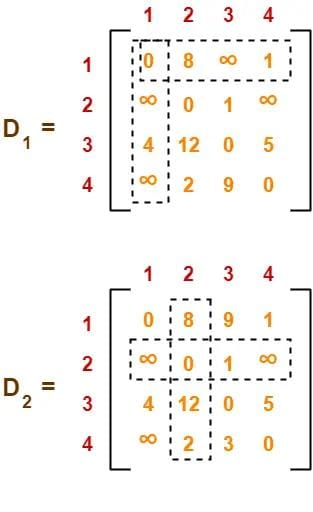
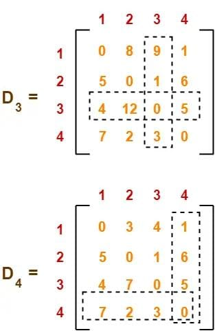

<style>

    .intro h1{
        font-size: 50px;
        display: flex;
        position: relative;
        font-family: Courier;

}
.intro h3{
    font-size:30px;
} 
.in{
    padding-top:16%;
    padding-left:20%;
}
.intro{
    padding: 4%;
    height: 50%;
    width: 100%;
    box-sizing: border-box;
    box-shadow: 0 30px 30px rgba(0,0,0);
    background: rgb(244, 241, 209) ;
    border-radius: 14px;
    border-color:  solid black;
}

.intro:hover{
    box-shadow: 0 65px 65px rgba(0,0,0,.5 );
}
h6{
	font-size: 30px;
}
.fontsize{
	font-size: 25px;
}
.end{
	text-align: center;
	color:whitesmoke;
    
	font-family: Courier;
	font-size: 70px;
	position: fixed;
    top: 4%;
    left: 30%;
}
.pad{
	 padding-bottom: 20%;
}
.usn{
	padding-top: 10%;
	text-align: right;
	color:white;
	font-size: 30px;
}
.iconbox{
	padding: 4%;
    height: 50%;
    width: 100%;
    box-sizing: border-box;
    box-shadow: 0 30px 30px rgba(0,0,0);
    background: grey;
    border-radius: 14px;
    border-color:  solid black;
}
.iconbox:hover{
    box-shadow: 0 65px 65px rgba(0,0,0,.5 );
}
</style>

<div class="in">
<div class="intro">

# Implementation of Floyd's algoritm :
### To find the shortest paths for all veritces in  a graph

</div>
</div>

---
#### Problem: 
- Given a weighted connected graph (directed or undirected), the **all-pairs shortest-paths problem** asks to find the distances (the length of the shortest paths) from each vertex to all other vertices.

* it is convenient to record the lengths of shortest paths in an n-by-n matrix D called the **distance matrix**: the element d<sub>ij</sub> in the ith row and jth column of this matrix indicates the length of shortest path from the ith vertex to the jth vertex.

---
- Floyd's algorithm computes the distance matrix of a weighted graph with n vertices through a series of n-by-n matrices:  $\mathcal{D^0},...,{D^k},...,D^n$
(k=0,1,....,n)
#### Algorithm :
```
//implements floyd's algorithm for all-pair shortest-paths problem
//input: the weight matrix W of a graph
//output: the distance matrix of the shortest paths lengths

D = W
for k = 1 to n do
    for i = 1 to n do
        for j= 1 to n do
            D[i,j] = min{ D[i,j] , D[i,j] + D[k,j] }
return D
```
---


#### Example:

- consider the weighted graph and its adjacency matrix
  

$$
\begin{align} 
k &= 1 \\
D^0[2][2] &= 0  \\
D^1[2][2] &=> D^0[2][1] + D^0[1][1]&= infinity \\
D^0[2][2] < infinity.\\
D^1=0  
\end{align}
$$

---
  


---
### C code:
```C
#include<stdio.h>
#include<stdlib.h>
#include<time.h>
#define INF 99999
int min(int,int);
void floyds(int p[10][10],int n) {
	int i,j,k;
	for (k=1;k<=n;k++)
	  for (i=1;i<=n;i++)
	   for (j=1;j<=n;j++)
	    if(i==j)
	     p[i][j]=0; else
	     p[i][j]=min(p[i][j],p[i][k]+p[k][j]);
}
int min(int a,int b) {
	if(a<b)
	  return(a); else
	  return(b);
}
```
---
```C
 void main() {
	clock_t start,end;
	int p[10][10],w,n,e,u,v,i,j;
	printf("\n Enter the number of vertices: ");
	scanf("%d",&n);
	printf("\n Enter the number of edges: ");
	scanf("%d",&e);
	for (i=1;i<=n;i++) {
		for (j=1;j<=n;j++){
		    if(i==j)
	                p[i][j]=0;
                    else
		        p[i][j]=INF;
		}
	}
	printf("\n Enter the edges with corresponding weights (source : destinatin  : weight) : \n");
	for (i=1;i<=e;i++) {
		scanf("%d %d %d",&u,&v,&w);
		p[u][v]=w;
	}
        printf("\n Matrix of input data:\n");
	for (i=1;i<=n;i++) {
		for (j=1;j<=n;j++){
		    if(p[i][j]==INF)
		        printf("INF\t");
		    else
		        printf("%d \t",p[i][j]);
                }
		printf("\n");
	 }
```
---
```C

 start=clock();
 floyds(p,n);
 end=clock();
 	 printf("\n Transitive closure:\n");
 	 for (i=1;i<=n;i++) {
		 for (j=1;j<=n;j++)
		    printf("%d \t",p[i][j]);
		 printf("\n");
	 }
	 printf("\n The shortest paths are:\n");
	 for (i=1;i<=n;i++)
	    for (j=1;j<=n;j++) {
		   if(i!=j)
		      printf("\n %d---->%d = %d",i,j,p[i][j]);
	 }
	 printf("\n Execution Time = %f",(((double)(end-start))/CLOCKS_PER_SEC));

 }

```
--- 


###### Output:
```powershell
PS C:\Users\user pc\Documents\ada lab> gcc floyd.c
PS C:\Users\user pc\Documents\ada lab> ./a.exe

 Enter the number of vertices: 4
 Enter the number of edges: 6

 Enter the edges with corresponding weights (source : destinatin  : weight) :
 1 2 8
 1 4 1
 2 3 1
 3 1 4
 4 2 2
 4 3 9

 Matrix of input data:
 0       8       INF     1
 INF     0       1       INF
 4       INF     0       INF
 INF     2       9       0

 Transitive closure:
 0       3       4       1
 5       0       1       6
 4       7       0       5
 7       2       3       0

 The shortest paths are:
 1---->2 = 3
 1---->3 = 4
 1---->4 = 1
 2---->1 = 5
 2---->3 = 1
 2---->4 = 6
 3---->1 = 4
 3---->2 = 7
 3---->4 = 5
 4---->1 = 7
 4---->2 = 2
 4---->3 = 3
Execution Time = 0.000002
```
---
#### Time complexity:
- ###### The time complexity of Floyd's algorithm is:
 $$\mathcal{O(V^3)}$$
######  where **V** is the number of vertices in the graph. This means that the time it takes to run the algorithm grows cubically with the number of vertices in the graph.
- ###### The algorithm achieves this time complexity by performing three nested loops over all the vertices in the graph to update the shortest path distances between each pair of vertices.
---
##### Python Code:
```python
import time
INF = 99999

def min(a, b):
    return a if a < b else b

def floyds(p, n):
    for k in range(1, n+1):
        for i in range(1, n+1):
            for j in range(1, n+1):
                if i == j:
                    p[i][j] = 0
                else:
                    p[i][j] = min(p[i][j], p[i][k] + p[k][j])


```
---
```python
def main():
    n = int(input("Enter the number of vertices: "))
    e = int(input("Enter the number of edges: "))
    
    p = [[INF for _ in range(n+1)] for _ in range(n+1)]

    for i in range(1, n+1):
        for j in range(1, n+1):
            if i == j:
                p[i][j] = 0

    print("Enter the edges with corresponding weights (source : destination : weight):")
    for _ in range(e):
        u, v, w = map(int, input().split())
        p[u][v] = w

    print("\nMatrix of input data:")
    for i in range(1, n+1):
        for j in range(1, n+1):
            if p[i][j] == INF:
                print("INF", end="\t")
            else:
                print(p[i][j], end="\t")
        print()

```
---
```python
    start=time.time();
    floyds(p, n)
    end=time.time();
    print("\nTransitive closure:")
    for i in range(1, n+1):
        for j in range(1, n+1):
            print(p[i][j], end="\t")
        print()

    print("\nThe shortest paths are:")
    for i in range(1, n+1):
        for j in range(1, n+1):
            if i != j:
                print(f"\n {i}---->{j}={p[i][j]}", end="")
    print()            
    print("execution time = ",(end-start))
    print()

if __name__ == "__main__":
    main()

```
---


#### Output:
```powershell
Enter the number of vertices:  4
Enter the number of edges:  6
Enter the edges with corresponding weights (source : destination : weight):
 1 2 8
 1 4 1
 2 3 1
 3 1 4
 4 2 2
 4 3 9

Matrix of input data:
0	8	INF	1	
INF	0	1	INF	
4	INF	0	INF	
INF	2	9	0	

Transitive closure:
0	3	4	1	
5	0	1	6	
4	7	0	5	
7	2	3	0	

The shortest paths are:

 1---->2=3
 1---->3=4
 1---->4=1
 2---->1=5
 2---->3=1
 2---->4=6
 3---->1=4
 3---->2=7
 3---->4=5
 4---->1=7
 4---->2=2
 4---->3=3
execution time =  4.0531158447265625e-05 
```
---
#### Difference between C and Python:
<div class="fontsize">

- ##### C is faster than Python due to its code being directly converted into machine code through compilation, while Python relies on interpretation at runtime.
- ##### C has a static type system, leading to more efficient memory allocation and manipulation of data.
- ##### Python's built-in abstractions and features can introduce overhead compared to C
- ##### Python is chosen for its ease of use, readability, and rapid development, while C is preferred for performance-critical tasks.

Python can be combined with C or C++ using interfaces like ctypes or Cython to leverage both language's strengths
</div>

---


<div class="pad">

<h1 class="end"> Thank you!  </h1>
</div>
<div class="iconbox">

&nbsp;&nbsp;&nbsp;&nbsp;&nbsp;&nbsp;&nbsp;&nbsp;&nbsp;&nbsp;&nbsp;&nbsp;&nbsp;&nbsp;&nbsp;&nbsp;&nbsp;&nbsp;&nbsp;&nbsp;&nbsp;&nbsp;&nbsp;&nbsp;&nbsp;&nbsp;&nbsp;&nbsp;&nbsp;&nbsp;&nbsp;
</div>
<h4 class="usn"> ~(3PD21CS055)</h4>